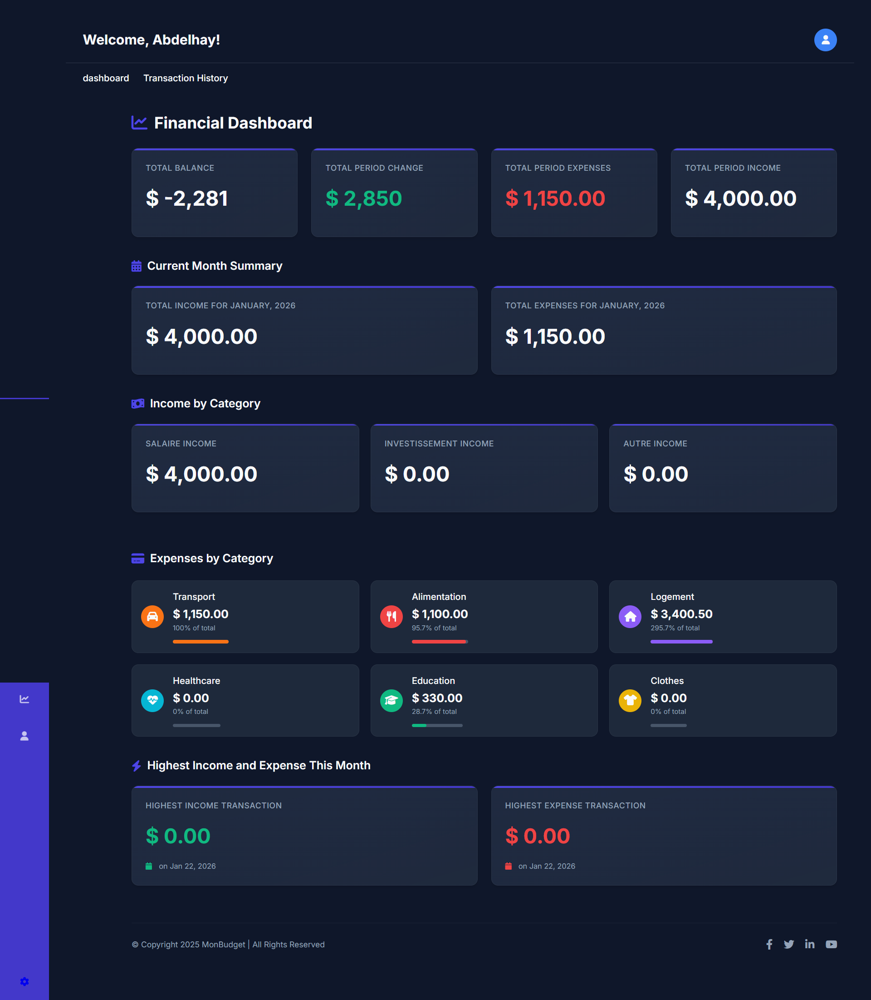
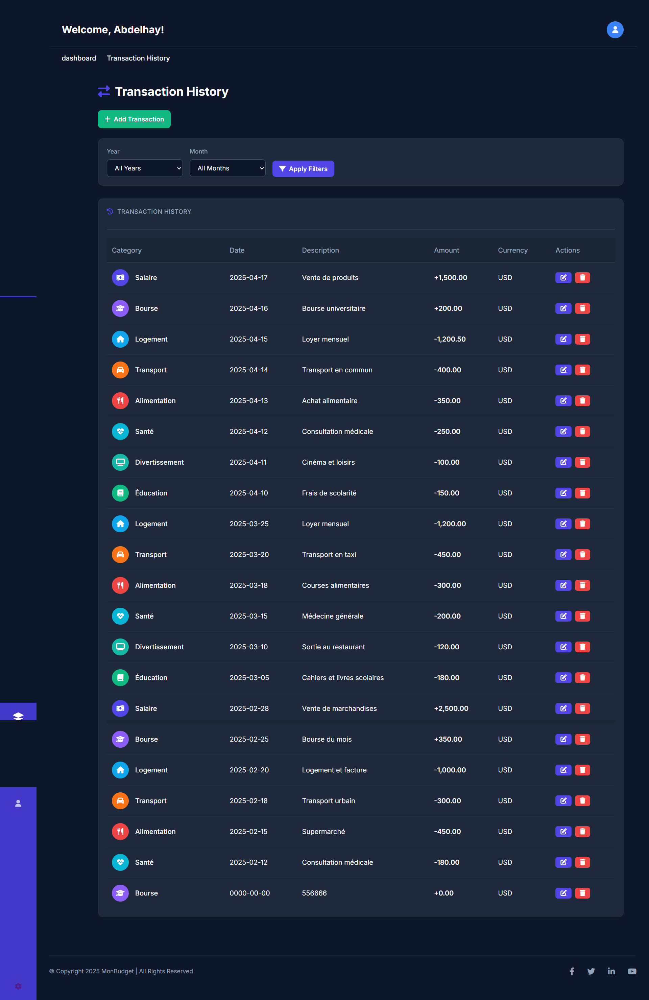

# Personal Finance Manager

A comprehensive personal finance management application built with **PHP** and **MySQL**. This application helps users track their income and expenses, categorize transactions, and visualize their financial health through an intuitive dashboard.



## 🚀 Features

- **User Authentication**: Secure login and registration system.
- **Dashboard**: Real-time overview of your financial status with:
  - Total Balance
  - Monthly Income vs Expenses
  - Visual Charts (Income/Expense distribution)
  - Recent Activity
- **Transaction Management**:
  - Add new income or expenses.
  - Edit or delete existing transactions.
  - Categorize transactions (e.g., Salary, Housing, Transport, Food).
- **Budget Tracking**: Monitor your spending against your income.
- **Responsive Design**: Works on desktop and mobile devices.

## 🛠️ Technologies Used

- **Frontend**: HTML5, CSS3, JavaScript, Chart.js (for data visualization), FontAwesome.
- **Backend**: Native PHP.
- **Database**: MySQL.
- **Server**: Apache (via XAMPP/WAMP).

## 📸 Screenshots

|              landing Page              |               Transactions List               |
| :----------------------------------: | :-------------------------------------------: |
|  |  |

## ⚙️ Installation & Setup

1.  **Clone the Repository**

    ```bash
    git clone https://github.com/abdelhaymallouli/personal-finance-manager-php.git
    ```

2.  **Configure the Database**
    - Open phpMyAdmin (usually at `http://localhost/phpmyadmin`).
    - Create a new database named `gestion_budget`.
    - Import the `sql/gestion_budget.sql` file provided in the `sql` folder.

3.  **Configure Database Connection**
    - Open `config/config.php` (if applicable) or check connection settings in `includes/db.php` (or wherever the connection is defined) to ensure it matches your local MySQL credentials:
      ```php
      $host = "localhost";
      $user = "root";
      $password = ""; // Default XAMPP password is empty
      $dbname = "gestion_budget";
      ```

4.  **Run the Application**
    - Move the project folder to your web server's root directory (e.g., `htdocs` in XAMPP).
    - Open your browser and navigate to:
      ```
      http://localhost/personal-finance-app-php/public/
      ```

## 📝 Usage

1.  **Register** a new account.
2.  **Login** to access your dashboard.
3.  **Add Transactions** via the "Add" button, specifying the amount, category, and date.
4.  **View Reports** on the dashboard to analyze your spending habits.

## 🤝 Contributing

Contributions are welcome! Please fork the repository and submit a pull request for any improvements.


